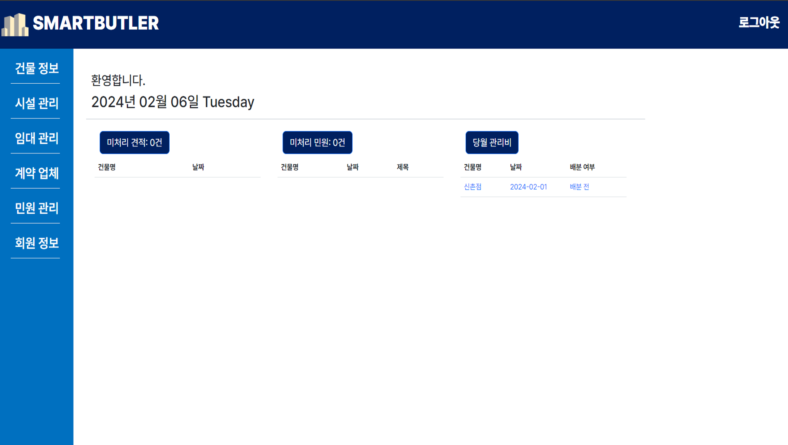

# SMARTBUTLER
>*시설물 관리 및 대여 시스템*

### 1. 개요

-  팀 소개 : 팀 와일드카드

      | 담당        | 이름        |
      | ----------- | ----------- |
      | 팀장        | 엄다빈      |
      | 팀원        | 정시운      |
      | 팀원        | 송창민      |
      | 팀원        | 전종배      |

- 개발 기간 : 2024-01-15 ~ 2024-02-05

### 2. 설계 배경

- 편리하고 효과적인 시설물 관리와 대여를 관리하는 환경 구축

### 3. 설계 목적  
- 시설물의 관리 및 대여에서 생기는 문서들의 전산화로 편의성 향상

### 4. 기대 효과  
- 시스템 전산화를 통한 빠른 업무처리 및 사용자들의 편의성과 관리 비용의 절감

### 5. UI/UX 특징
- 사용자 페이지 – 익숙하고 편안한 느낌으로 편의성과 접근성 강조하여 설계
- 관리자 및 작업자 페이지 – 고령 또는 웹에 익숙하지 않은 사용자 편의와 접근성을 생각하여 화면 설계 

### 6. 기능 요약
- 관리자
  - 건물 정보
  - 시설 관리
  - 임대 관리
  - 계약 업체
  - 민원 관리
  - 회원 정보

- 사용자
  - 마이페이지
  - 건물정보보기
  - 관리비 조회
  - 견적 신청
  - 민원 신청

- 작업자
  - 요청 목록

### 7. 참고 이미지
  메인 화면

  

  관리자

  

  사용자

  

  관리비

  

  작업자

  
